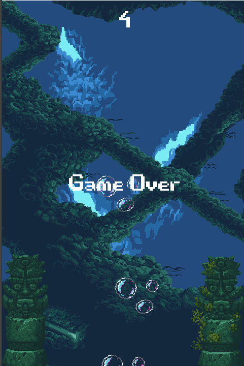

# dodge-the-fish
A simple dodging game where you control a scuba diver and save him from some nasty fish!
Your goal in this game is to survive the maximum amount of time against hordes of fish who are coming for you.
Dont get eaten. Good Luck!
## Gameplay
Some images of gameplay before you play!
<blockquote> Still: Roaming around. </blockquote>

<blockquote> HELP: About to be eaten! </blockquote>

<blockquote>OVER: Classic Game over screen.</blockquote>

## Installation
No complicated stuff just download zip from <a href = "https://github.com/CjSidharth/dodge-the-fish/blob/main/DTF.zip">here </a> and run.
## Editing
Just download whole repo and open project.godot using Godot. This was made at that time using Godot 3.3 but it is compatible with Godot 3.5 LTS.
## Background
This was made way back in 2021 when I was exploring things with Godot. So it's essentially based on the similar named game Dodge The Creeps in the documentation.
Fabulous pixel art was provided by <a href = "https://opengameart.org/users/ansimuz"> ansimuz </a>. This art specifically can be found <a href="https://opengameart.org/content/underwater-diving-pack"> here</a>.
All other assets like music were from Godot Demo package.
